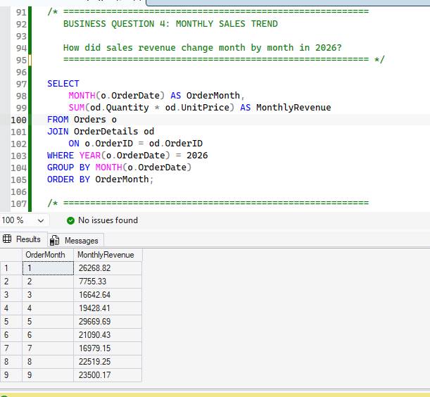

# Retail Sales Analytics — SQL Server

## Project Overview

This project analyzes retail sales data using Microsoft SQL Server. The goal is to answer business questions related to customer behavior, sales performance, product performance, and customer segmentation.

The project demonstrates how SQL can be used to transform transactional retail data into useful business insights.

## Database Structure

The database contains four related tables:

- Customers — customer information and join dates
- Orders — customer orders and order dates
- OrderDetails — products, quantities, and prices for each order
- Products — product names, categories, and pricing information

## Business Questions

1. Which states have the largest customer base?
2. How many new customers joined each year?
3. What is the total revenue generated by the business?
4. How did sales revenue change month by month in 2026?
### Monthly Sales Trend

5. Which product categories generate the most revenue?
6. Which products generate the most revenue?
7. Which customers generate the most revenue?
8. How can customers be segmented based on total spending?
9. What is the average order value?
10. Which product generates the highest revenue within each category?

## SQL Skills Demonstrated

- SELECT and filtering
- Aggregate functions: SUM, COUNT, AVG
- GROUP BY and ORDER BY
- INNER JOIN
- Subqueries
- Common Table Expressions (CTEs)
- CASE expressions
- Window functions
- RANK()
- PARTITION BY
- Date analysis using YEAR() and MONTH()

## Key Findings

- Total revenue in the dataset was $413,499.62.
- Illinois had the largest customer base with 32 customers.
- Fitness was the highest-revenue product category at $94,657.05.
- Customer segmentation was used to classify customers into High, Medium, and Low Value groups.
- Product ranking identified the highest-revenue product within each category.

## Tools

- Microsoft SQL Server
- SQL Server Management Studio / SQL Server development environment
- GitHub

## Project Files

`RetailSalesAnalytics.sql` contains the database schema and all SQL queries used for the analysis.
